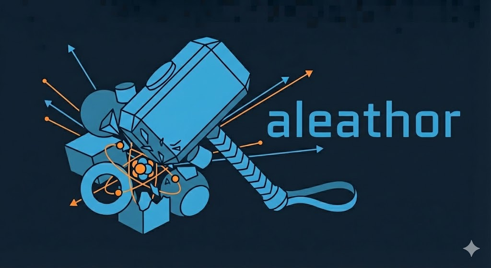

# aleathor

<p align="center">
  
</p>

A Python library for debugging and analyzing large Constructive Solid Geometry (CSG) models used in neutron and gamma transport simulations.

While other excellent packages exist for constructing CSG geometries programmatically, aleathor focuses on **debugging, visualization, and analysis** of existing models. It can read MCNP and OpenMC geometry files, perform fast ray tracing to identify geometry errors, and generate plots of arbitrary cross-sections.


**The package is still under development.**

## Disclaimer

This package was developed with support of AI tools.

## Key Features (under development)

### Geometry Import

- **MCNP Input Files**: Read complex MCNP geometry definitions including cells, surfaces, universes, and transforms
- **OpenMC Models**: Import OpenMC XML geometry files (planned)
- **Automatic Surface Expansion**: Macrobodies are expanded to their constituent surfaces

### Geometry Debugging

- **Point Queries**: Instantly find which cell contains any point in the geometry
- **Ray Tracing**: Trace rays through the model to identify lost particles, overlaps, and undefined regions
- **Path Length Calculations**: Compute material-specific path lengths for shielding analysis
- **Cell Filtering**: Query cells by material, universe, fill, or custom predicates

### Visualization

- **2D Slice Plots**: Generate cross-section plots along X, Y, Z, or arbitrary planes
- **Filled Plots**: Color regions by cell ID or material
- **Contour Control**: Draw contour lines by cell or material boundaries (`contour_by`)
- **Tally Overlay**: Overlay mesh tally data (flux, dose) on geometry with log/linear scaling
- **Multi-View Layouts**: Generate XY, XZ, YZ views simultaneously
- **Ray Path Visualization**: Plot ray trajectories showing material transitions

### Mesh Export

- **Gmsh/VTK Export**: Export geometry as structured hexahedral meshes for visualization in Gmsh or ParaView
- **Material Sampling**: Sample material/cell IDs on a 3D grid for analysis

### CSG Optimization

- **Full Simplification**: Complement elimination, double-negation removal, subtree deduplication, and more
- **BBox Tightening**: Interval arithmetic and numerical fallback for tight bounding boxes
- **Primitive Inspection**: Query full geometric data (centers, radii, coefficients) for any CSG leaf node

### Performance

- **C Backend**: Core geometry operations implemented in C for speed
- **Large Model Support**: Designed for models with 10,000+ cells (tokamak-scale)
- **Efficient Queries**: Optimized data structures for fast point-in-cell lookups


## Installation

```bash
# Clone with submodules
git clone --recurse-submodules https://github.com/giovanni-mariano/aleathor.git
cd aleathor

# Install in development mode
pip install -e .
```

### Requirements

- Python >= 3.9
- C compiler (gcc or clang)
- Make
- Optional: matplotlib, numpy (for plotting)

### Build options

Two environment variables control the build. They work both from source and from PyPI (using `--no-binary` to force a source build instead of downloading a prebuilt wheel).

| Variable | Default | Effect |
|----------|---------|--------|
| `PORTABLE` | `1` | When `0`, compiles with `-march=native` for maximum performance on your CPU. Do **not** distribute wheels built this way. |
| `USE_OPENMP` | `0` | When `1`, enables OpenMP parallelism. Requires an OpenMP-capable compiler. |

From source:

```bash
PORTABLE=0 USE_OPENMP=1 pip install -e .
```

From PyPI:

```bash
PORTABLE=0 USE_OPENMP=1 pip install --no-binary aleathor aleathor
```

## Quick Start

### Loading and Debugging an MCNP Model

```python
import aleathor as ath

# Load an existing MCNP input file
model = ath.load("tokamak_model.inp")

print(f"Loaded {len(model.cells)} cells, {len(model.surfaces)} surfaces")

# Find what cell contains a specific point
cell = model.cell_at(100, 0, 0)
if cell:
    print(f"Point (100,0,0) is in cell {cell.id}, material {cell.material}")
else:
    print("Point is in void or undefined region!")

# Trace a ray to check for geometry errors
trace = model.trace(start=(-500, 0, 0), end=(500, 0, 0))
for seg in trace:
    if seg.cell:
        print(f"Cell {seg.cell.id}: {seg.length:.2f} cm, material {seg.material}")
    else:
        print(f"VOID: {seg.length:.2f} cm  <-- potential geometry error!")
```

### Plotting Cross-Sections

```python
# Plot XY cross-section at z=0
model.plot(z=0, bounds=(-100, 100, -100, 100))

# Plot by material instead of cell
model.plot(z=0, by_material=True, show_colorbar=True)

# Control contour boundaries: 'cell', 'material', or None (auto)
# When by_material=True or overlay is set, contours auto-follow materials
model.plot(z=0, by_material=True, contour_by='cell')  # override: cell contours

# Overlay mesh tally data on geometry
import numpy as np
flux = np.load("flux_z0.npy")
model.plot(z=0, bounds=(-100, 100, -100, 100),
           overlay=flux, overlay_norm='log',
           overlay_label='Flux [n/cm²/s]', show_colorbar=True)

# Save to file
model.plot(z=50, save="midplane.png")

# Generate three orthogonal views
model.plot_views(bounds=(-100, 100, -100, 100, -100, 100), save="views.png")
```

### Analyzing Cells

```python
# List all materials in the model
print(f"Materials used: {model.cells.materials()}")

# Find all cells with a specific material (e.g., tungsten)
tungsten_cells = model.cells.by_material(74)
print(f"Found {len(tungsten_cells)} tungsten cells")

# Find cells in a specific universe
blanket_cells = model.cells.by_universe(100)

# Custom filtering
dense_cells = model.cells.filter(lambda c: abs(c.density) > 10.0)
```

### Ray Tracing for Shielding Analysis

```python
# Trace from plasma center through the blanket
trace = model.trace(
    origin=(0, 0, 0),
    direction=(1, 0, 0),
    max_distance=1000.0
)

# Calculate path length through specific materials
steel_path = trace.path_length(material=26)  # Iron/steel
water_path = trace.path_length(material=1)   # Water

print(f"Steel: {steel_path:.2f} cm, Water: {water_path:.2f} cm")

# List all materials encountered
print(f"Materials hit: {trace.materials_hit()}")
```

## Use Cases

### Fusion and Tokamak Modeling

aleathor was specifically designed for debugging Tokamak-scale fusion reactor models:

- Identify lost particle regions before running expensive Monte Carlo simulations
- Verify material assignments across thousands of cells
- Check universe fill hierarchies

### Shielding Analysis

- Trace rays from source to detector locations
- Calculate line-of-sight path lengths through materials
- Identify streaming paths through geometry

### Model Conversion

- From MCNP to OpenMC and vice-versa 


## Documentation

| Document | Audience | Purpose |
|----------|----------|---------|
| [Tutorial](docs/TUTORIAL.md) | New users | Walk-through from loading a model to exporting results |
| [Concepts](docs/CONCEPTS.md) | All users | Surfaces, sense, regions, cells, universes, and other domain concepts |
| [Architecture](docs/ARCHITECTURE.md) | Contributors | Internal data model, dual representation, and design decisions |
| [API Reference](docs/API.md) | All users | Every public class and function, grouped by task |

Start with the **Tutorial** if you're new. Refer to **Concepts** when something doesn't behave as you expect. The **API Reference** is for when you know what you want but forgot the method name.

## Quick API Reference

### Model Class

```python
model = ath.load("input.inp")     # Load from file
model = ath.Model("name")         # Create empty model

model.cells                       # CellCollection
model.surfaces                    # Dict of surfaces
model.cell_at(x, y, z)           # Point query
model.trace(start, end)          # Ray trace
model.plot(z=0)                  # Visualization
model.save("output.inp")         # Export
```

### CellCollection

```python
model.cells.by_material(mat_id)   # Filter by material
model.cells.by_universe(univ_id)  # Filter by universe
model.cells.by_fill(fill_id)      # Filter by fill
model.cells.filter(predicate)     # Custom filter
model.cells.get(cell_id)          # Get by ID
model.cells.materials()           # Unique materials
model.cells.universes()           # Unique universes
```

### TraceResult

```python
trace = model.trace(start, end)
len(trace)                        # Number of segments
trace.path_length(material=1)     # Path through material
trace.cells_hit()                 # List of cells
trace.materials_hit()             # Set of materials

for seg in trace:
    seg.cell                      # Cell (or None for void)
    seg.length                    # Segment length
    seg.material                  # Material ID
    seg.t_enter, seg.t_exit      # Entry/exit distances
```

## Examples

See the `examples/` directory:

- `basic_usage.py` - Basic geometry construction and queries
- `advanced_surfaces.py` - All supported surface types
- `plotting_example.py` - Visualization and cross-section plots

## License

MPL-2.0

## Contributing

Contributions are welcome! Please open an issue or submit a pull request.
